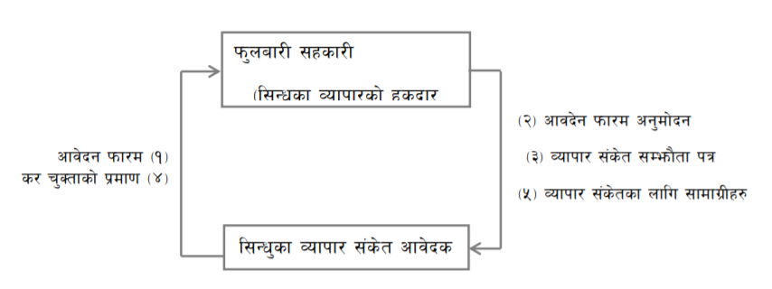

- १. फुलबारी सहकारीमा आवेदन फारम भरि बुझाउनुहोस्
- २. अनुमोदन प्राप्त गर्नु होस्
- ३. संकेत सम्झौता पत्रमा हस्ताक्षर गर्नु होस्
- ४. आवश्यक संस्थागत तथा कानुनी करहरु तिर्नुहोस्
- ५. सिन्धुकावाट सबै आवश्यक सामग्री प्राप्त गनुहोस्

[Download the guidelines (English)](guidelines/SINDHUKA_Collective_Trademark_Regulation_EN.pdf)

[Download the guidelines (Nepali)](guidelines/SINDHUKA_Collective_Trademark_Regulation_NE.pdf)

